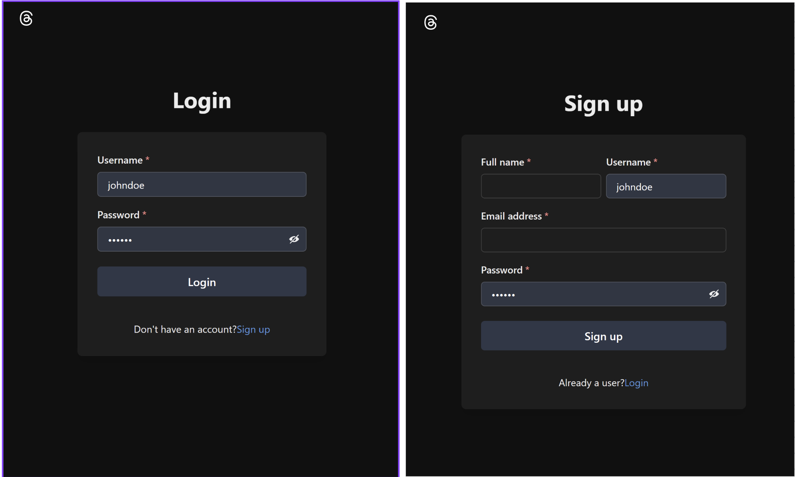
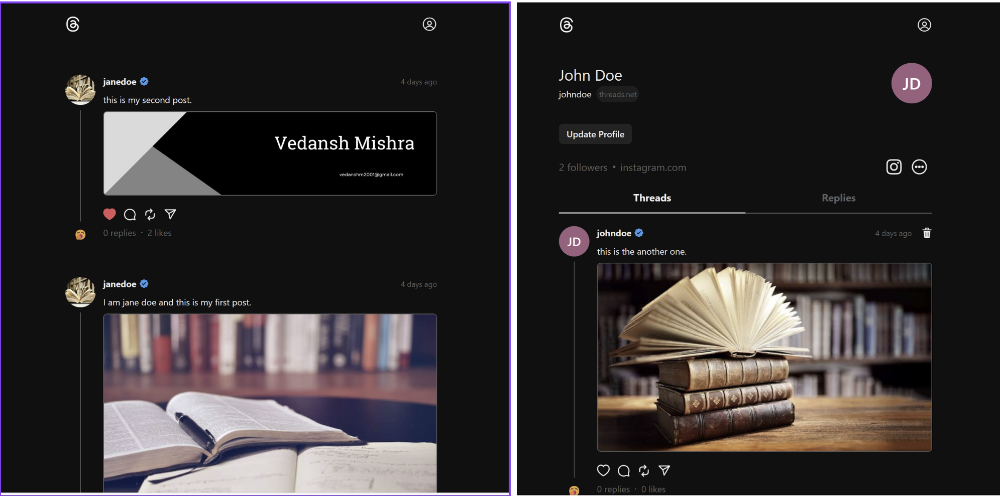
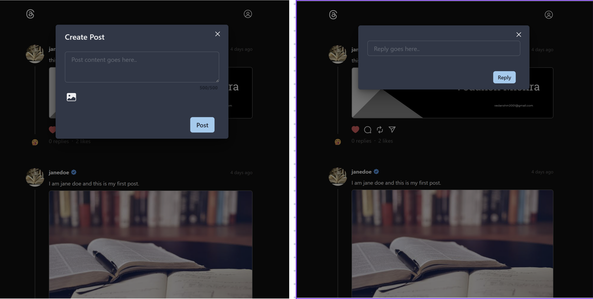
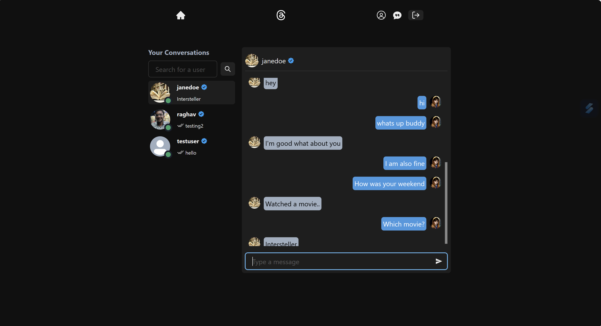

# Social Media App

This is a comprehensive MERN stack based social media app.
This application encompasses all the fundamental functionalities expected from a social media platform, along with advanced features like live chat and file sharing.

## Features

- 🎃 Authentication & Authorization with JWT
- 🗑️ Delete Post
- 🗑️ Delete Post
- ❤️ Like/Unlike Post
- 💬 Comment to a Post
- 👥 Follow/Unfollow Users
- ❄️ Freeze Your Account
- 🌓 Dark/Light Mode
- 📱 Completely Responsive
- 💬 Chat App With Image Support

 

## Screenshots

## Deployment

I am currently in the development phase of the project and have not deployed it yet.
Upon completion, I plan to deploy it on either Vercel or AWS EC2 to ensure seamless accessibility and performance.

